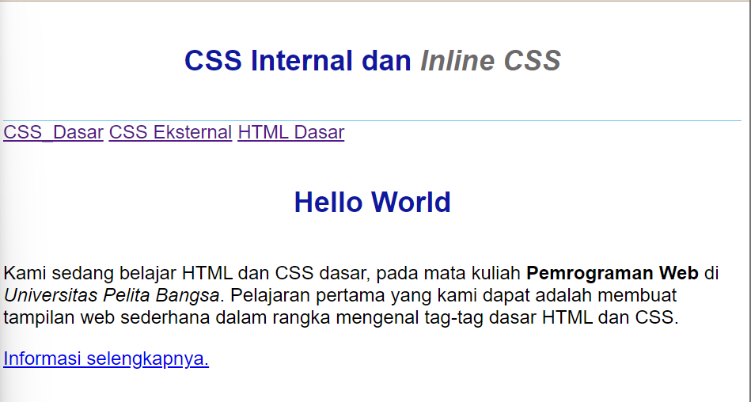
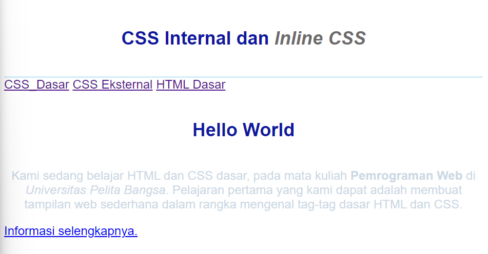
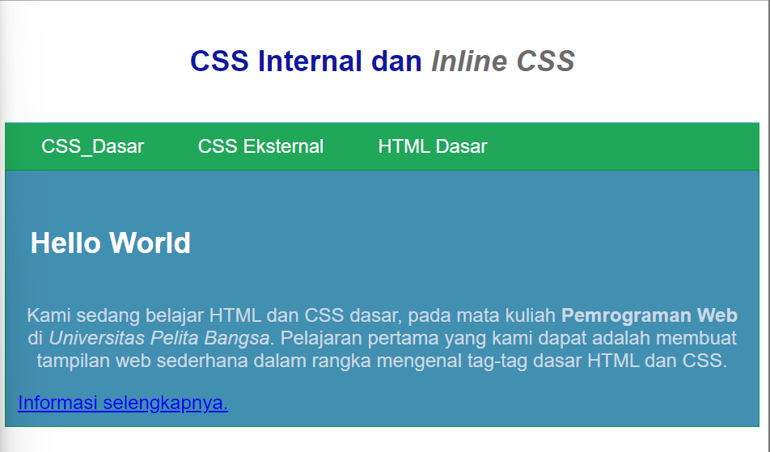
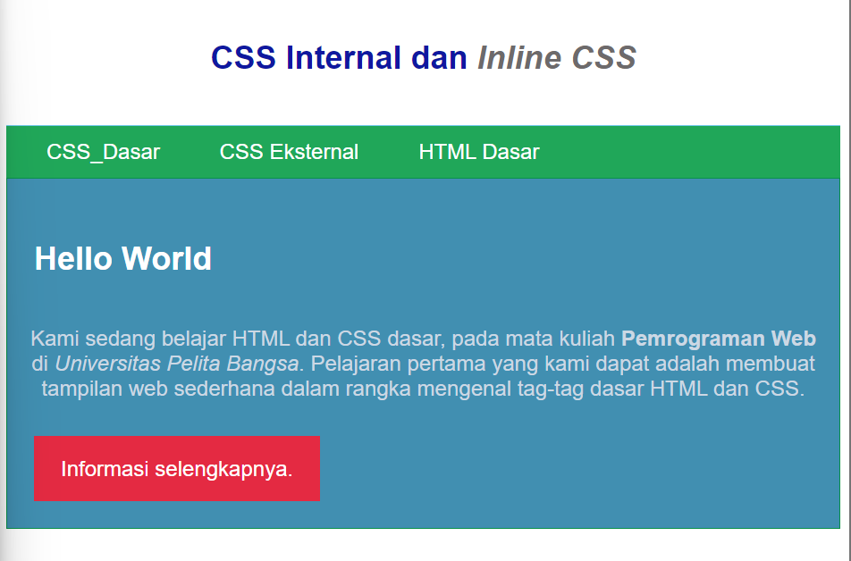

# **Lab 2 Web**

```
Nama    : Dipca Anugrah
NIM     : 312210666
Kelas   : TI.2.A.4
MATKUL  : Pemrograman Web 1
```

## **Daftar Isi**

**1. [Instruksi Praktikum](#instruksi-praktikum)**  
**2. [Langkah-langkah Praktikum](#langkah-langkah-praktikum)**  
**3. [Pertanyaan dan Tugas](#pertanyaan-dan-tugas)**

## **Instruksi Praktikum**

1. Persiapkan text editor misalnya VSCode.
2. Buat file baru dengan nama lab2_css_dasar.html
3. Buat struktur dasar dari dokumen HTML.
4. Ikuti langkah-langkah praktikum yang akan dijelaskan berikutnya.
5. Lakukan validasi dokumen css dengan mengakses https://jigsaw.w3.org/css-validator/

## **Langkah-langkah Praktikum**

**1. Membuat dokumen HTML**

```html
<!DOCTYPE html>
<html lang="en">
  <head>
    <meta charset="UTF-8" />
    <meta name="viewport" content="width=device-width, initial-scale=1.0" />
    <title>CSS Dasar</title>
  </head>
  <body>
    <header>
      <h1>CSS Internal dan <i>Inline CSS</i></h1>
    </header>
    <nav>
      <a href="lab2_css_dasar.html">CSS Dasar</a>
      <a href="lab2_css_eksternal.html">CSS Eksternal</a>
      <a href="lab1_tag_dasar.html">HTML Dasar</a>
    </nav>
    <!-- CSS ID Selector -->
    <div id="intro">
      <h1>Hello World</h1>
      <p>
        Kami sedang belajar HTML dan CSS dasar, pada mata kuliah
        <b>Pemrograman Web</b> di <i>Universitas Pelita Bangsa</i>. Pelajaran
        pertama yang kami dapat adalah membuat tampilan web sederhana dalam
        rangka mengenal tag-tag dasar HTML dan CSS.
      </p>
      <!-- CSS Class Selector -->
      <a class="button btn-primary" href="#intro">Informasi selengkapnya.</a>
    </div>
  </body>
</html>
```

<br>


**2. Mendeklarasikan CSS Internal**

```html
<head>
  <title>CSS Dasar</title>
  <style>
    body {
      font-family: "Open Sans", sans-serif;
    }
    header {
      min-height: 80px;
      border-bottom: 1px solid #77ccef;
    }
    h1 {
      font-size: 24px;
      color: #0f189f;
      text-align: center;
      padding: 20px 10px;
    }
    h1 i {
      color: #6d6a6b;
    }
  </style>
</head>
```

<br>



**3. Menambahkan Inline CSS**

```html
<p style="text-align: center; color: #ccd8e4;"></p>
```

<br>



**4. Membuat CSS Eksternal**

```css
nav {
  background: #20a759;
  color: #fff;
  padding: 10px;
}
nav a {
  color: #fff;
  text-decoration: none;
  padding: 10px 20px;
}
nav .active,
nav a:hover {
  background: #0b6b3a;
}
```

```html
<head>
  <!-- menyisipkan css eksternal -->
  <link rel="stylesheet" href="style_eksternal.css" type="text/css" />
</head>
```

<br>


**5. Menambahkan CSS Selector**

```css
/* ID Selector */
#intro {
  background: #418fb1;
  border: 1px solid #099249;
  min-height: 100px;
  padding: 10px;
}
#intro h1 {
  text-align: left;
  border: 0;
  color: #fff;
}
/* Class Selector */
.button {
  padding: 15px 20px;
  background: #bebcbd;
  color: #fff;
  display: inline-block;
  margin: 10px;
  text-decoration: none;
}
.btn-primary {
  background: #e42a42;
}
```

<br>



## **Pertanyaan dan Tugas**

1.  Lakukan eksperimen dengan mengubah dan menambah properti dan nilai pada kode CSS dengan mengacu pada CSS Cheat Sheet yang diberikan pada file terpisah dari modul ini.  
    **Jawaban:**

2.  Apa perbedaan pendeklarasian CSS elemen h1 {...} dengan #intro h1 {...}? berikan penjelasannya!  
    **Jawaban:**

    - `h1{...}` ini adalah selektor CSS yang menargetkan semua elemen `h1` pada halaman web. Semua elemen `h1` akan menerima gaya(style) yang sama sesuai aturan CSS yang didefinisikan didalam blok ini.
    - `#intro h1{...}` ini adalah selektor CSS yang menargetkan `h1` yang berada di dalam elemen dengan `id="intro"`. Hanya elemen `h1` yang berada dalam elemen dengan `id="intro"` yang akan menerima gaya (style) yang didefinisikan dalam blok ini.

3.  Apabila ada deklarasi CSS secara internal, lalu ditambahkan CSS eksternal dan inline CSS pada elemen yang sama. Deklarasi manakah yang akan ditampilkan pada browser Berikan penjelasan dan contohnya!  
    **Jawaban:**  
     Urutan penulisan berperan ketika spesifisitasnya sama. Spesifisitas diukur berdasarkan kombinasi dari selektor CSS yang digunakan. Semakin spesifik selektor, semakin tinggi spesifisitasnya.

    Umumnya, urutan prioritas adalah sebagai berikut (dari yang paling rendah ke yang paling tinggi):

    - 1). Deklarasi CSS dari file eksternal.
    - 2). Deklarasi CSS yang ada secara internal.
    - 3). Deklarasi inline CSS.

    **Contoh**  
    [jawaban.html](jawaban.html)
    <br>

4.  Pada sebuah elemen HTML terdapat ID dan Class, apabila masing-masing selector tersebut terdapat deklarasi CSS, maka deklarasi manakah yang akan ditampilkan pada browser?
    Berikan penjelasan dan contohnya! `( <p id="paragraf-1" class="text-paragraf"> )`  
     **Jawaban:**
    Ketika sebuah elemen HTML memiliki baik ID maupun class, CSS selector yang memiliki spesifisitas yang lebih tinggi akan memiliki prioritas. Urutan prioritas biasanya adalah:

    ID Selector: Selector dengan ID memiliki spesifisitas yang tinggi karena ID harus unik dalam satu halaman. Jadi, deklarasi CSS dengan ID selector akan memiliki prioritas tertinggi.

    Class Selector: Selector dengan class memiliki spesifisitas yang lebih rendah daripada ID, tetapi lebih tinggi daripada selector elemen saja. Jika ada beberapa elemen dengan class yang sama, semua elemen tersebut akan memengaruhi gaya yang dideklarasikan dalam class tersebut.

    **Contoh**  
    [jawaban.html](jawaban.html)
    <br>

**[back-->](#lab-2-web)**
